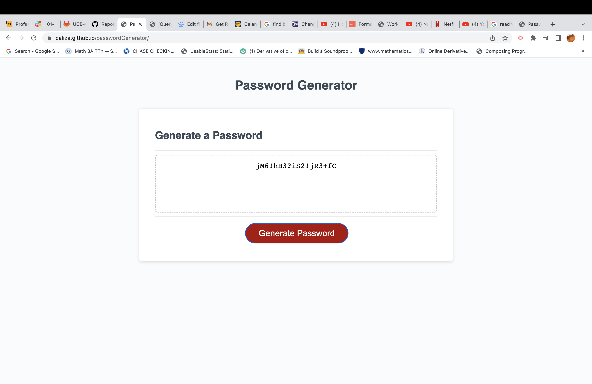

# Password Generator

## Description

When Generate Password button os clicked, user is prompted to select what type of characters the would like to be included in their password: lowerCase letter, upperCase letters, special characters, and/or number. After selceting which type of characters they would like to use in their password, they must select a password length between 8 and 128 charachters.

- Create an app that a user could use to create a secure password.
- To provide an app for users looking for more options when seeking an app that provides this service.
- Generates a strong/secure password.
- Learned how to use a for loop, strings, arrays, for and while loop to create array.

## Usage

https://caliza.github.io/javascriptQuiz/

## User instruction: click on Generate Password button and select characters to be included in password. Then choose a password length between 8-128 characters. 
